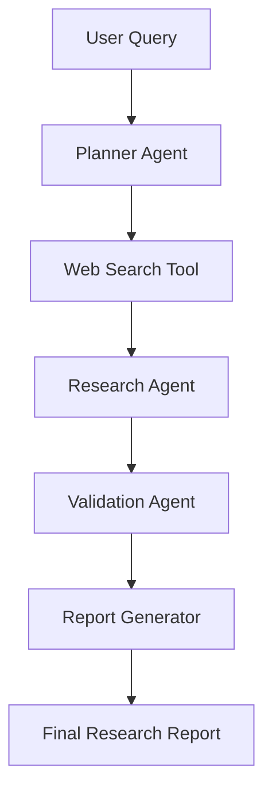

# Personal Research Agent

An intelligent, multi-agent Personal Research Assistant built using **Python**, **LangChain**, **LangGraph**, **FastAPI**, and **OpenAI / NVIDIA NIM**.

The agent is designed to take a complex research query, search the web, gather relevant evidence, validate source quality, remove duplicates, and generate a structured research report with citations.

---

## 🚀 Core Workflow (Plan)



*Currently: Phase 1 (Web Search + Summarization MVP) is complete and fully functional.*

---

## 🛠️ Tech Stack

*   **Logic & Agent Engine:** Python 3.12, LangChain, LangGraph
*   **API Framework:** FastAPI, Uvicorn
*   **Search Engine:** DuckDuckGo (`ddgs`), Tavily Search (optional)
*   **LLM Providers:** OpenAI API or NVIDIA NIM (Llama 3.1 70B recommended)
*   **Database:** PostgreSQL (with SQLAlchemy)
*   **Containerization:** Docker & Docker Compose

---

## 📂 Folder Structure

```
├── .env.example            # Environment variables template
├── .gitignore              # Git ignore file
├── requirements.txt        # Python dependencies
├── Dockerfile              # Container config for FastAPI app
├── docker-compose.yml      # Orchestrates FastAPI & Postgres containers
├── README.md               # Project documentation
│
├── app/
│   ├── main.py             # FastAPI App Entrypoint
│   ├── core/               # Configuration & DB Engine
│   │   ├── config.py       # Pydantic Settings
│   │   └── database.py     # SQLAlchemy connections
│   ├── models/             # SQLAlchemy DB schemas
│   ├── schemas/            # Request/Response validation schemas
│   ├── services/           # Business logic layer
│   └── agent/              # LangGraph orchestration
│       ├── state.py        # Graph state
│       ├── graph.py        # Graph compilation
│       ├── llm.py          # LLM client setup
│       ├── nodes/          # Agent nodes (research, summarizer)
│       └── tools/          # Web search integration
```

---

## ⚙️ Configuration Setup

1. Copy `.env.example` to create your local `.env`:
   ```bash
   cp .env.example .env
   ```
2. Open `.env` and fill in your keys:
   ```env
   # Choose 'nvidia' or 'openai'
   LLM_PROVIDER=nvidia
   
   # For NVIDIA (Uses compatible OpenAI endpoints)
   NVIDIA_API_KEY=your_nvidia_api_key_here
   LLM_MODEL=meta/llama-3.1-70b-instruct
   
   # For OpenAI
   OPENAI_API_KEY=your_openai_api_key_here
   LLM_MODEL=gpt-4o-mini
   ```

---

## 💻 Local Quickstart

### 1. Installation & Environment Setup
Create a virtual environment and install packages:
```bash
python3 -m venv .venv
source .venv/bin/activate
pip install -r requirements.txt
```

### 2. Run Direct Agent CLI Test
You can test the search and summarizer agent workflow directly from your command line:
```bash
python test_agent.py
```

### 3. Run FastAPI Application
Start the development server:
```bash
python -m app.main
```
Or use uvicorn:
```bash
uvicorn app.main:app --reload --port 8000
```
-
---

## 🐳 Docker Deployment

To spin up the complete development environment including the FastAPI web app and a PostgreSQL database instance:

```bash
docker-compose up --build
```

